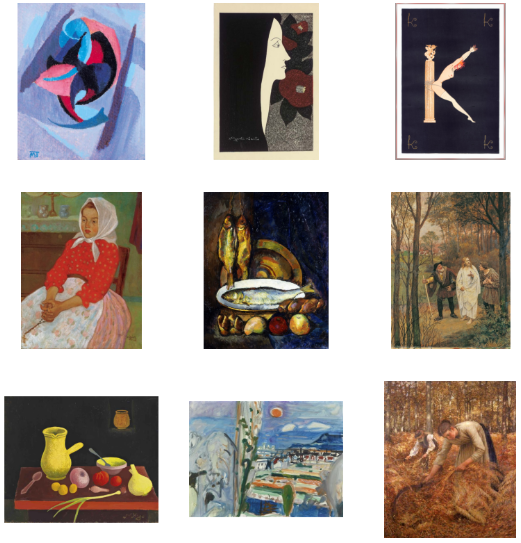
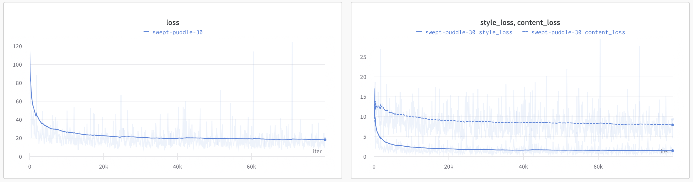

# Zadanie 3

Filip Petrán, Jakub Povinec

- [github](https://github.com/ns-super-team/assignment-3)

---

## Cieľ

Cieľom tohto zadania bolo vytvoriť a natrénovať model pre *Style Transfer* pomocou metódy *AdaIN (Adaptive Instance Normalisation)*. Ide teda o prenos štýlu z jedného obrázka na obsah druhého obrázka. Pre vykonanie Style Transferu je teda potrebné mať vždy 2 vstupné obrázky - štýlový a obsahový.

## Dáta

Pre tento problém sme pracovali s dvomi datasetmi. Jeden, v ktorom sa nachádzajú štýlové obrázky a druhý, v ktorom sa nachádzajú obsahové obrázky. Ako štýlový dataset sme použili [dataset umeleckých diel z WikiArt](https://www.kaggle.com/competitions/painter-by-numbers/data) a ako obsahový dataset sme použili [dataset COCO](https://cocodataset.org/#download).

### Vzorka dát



Vzorka štýlových dát (WikiArt dataset)


Vzorka obsahových dát (COCO dataset)

## **Model**

Pri vytváraní modelu sme sa riadili článkom od Huang et al. [1], v ktorom autori po prvýkrát opisujú *Adaptive Instance Normalization* a využitie tejto metódy na *Style Transfer*. Architektúra, ktorú autori použili pozostáva z enkódera, AdaIN vrstvy a dekódera.


Enkóder je tvorený prvými štyrmi vrstvami predtrénovaného modelu VGG-19. AdaIN vrstva predstavuje matematickú operáciu, do ktorej vstupujú 2 parametre a to štýlový obrázok ($y$) a obsahový obrázok ($x$), ktoré prešli enkóderom. Operácia AdaIN vyzerá nasledovne:

$$
AdaIN(x, y) = \sigma(y)(\frac{x-\mu(x)}{\sigma(x)})+\mu(y)
$$

V operácii AdaIN sa normalizovaný obsahový obrázok škáluje smerodajnou odchýlkou štýlového obrázku a posunie sa o strednú hodnotu štýlového obrázku.

```python
class AdaIN(nn.Module):
    def __init__(self, epsilon=1e-5):
        super().__init__()
        self.epsilon = epsilon

    def forward(self, content: torch.Tensor, style: torch.Tensor) -> torch.Tensor:
        return (torch.mul(sigma(style, self.epsilon), ((content - mi(content)) / sigma(content, self.epsilon))) + mi(style))
```

Výstup z AdaIN vrstvy je zároveň vstupom do dekódera. Dekóder pozostáva z rovnakých vrstiev ako enkóder, ale v opačnom poradí (zdrkadlovo), pričom operácie MaxPooling boli nahradené operáciami Upsample. Výstupom dekódera je teda kombinácia štýlu a obsahu dvoch pôvodných obrázkov. Enkóder sa potom ešte používa druhýkrát pri počítaní content loss ($L_C$) a style loss ($L_S$).

## Trénovanie

Pri trénovaní sme použili optimizer Adam s learning rate 0.0001. Vyskúšali sme rôzne veľkosti batch-size (8, 4). Batch bol v tomto prípade tvorený pármi obrázkov (štýlový a obsahový obrázok). Keďže enkóder je vlastne predtrénovaný model VGG-19 (resp. jeho časť) a AdaIN je iba matematická operácia bez naučiteľných parametrov, v celom modeli sa učil iba dekóder. 

Pre natrénovanie dekódera sa počítala celková loss ($L$), ktorá pozostáva z dvoch častí, content a style loss.

$$
L=L_C+\lambda L_s
$$

$L_C$ predstavuje content loss, ktorý opisuje vzdialenosť (rozdiel) medzi pôvodným obrázkom a výstupom z AdaIN. $L_S$ zas predstavuje style loss, teda súčet vzdialeností strednej hodnoty a smerodajné odchýlky výstupov jednotlivých vrstiev (aktivácií) enkódera pre štýlový a výstupný obrázok. Vo vzťahu ešte figuruje parameter $\lambda$, ktorý je v tomto prípade novým hyperparametrom. Úpravou tohto parametra je možné určiť, do akej miery sa má preniesť štýl zo štýlového obrázka.

```python
def content_loss(self, enc_out: torch.Tensor, t: torch.Tensor) -> torch.Tensor:
    return F.mse_loss(enc_out, t)
    
def style_loss(self, out_activations: dict, style_activations: dict) -> torch.Tensor:
	means, sds = 0, 0
	for out_act, style_act in zip(out_activations.values(), style_activations.values()):
		means += F.mse_loss(mi(out_act), mi(style_act))
		sds += F.mse_loss(sigma(out_act), sigma(style_act))
		
	return means + sds

def loss(self, enc_out: torch.Tensor, t: torch.Tensor, out_activations: dict, style_activations: dict) -> torch.Tensor:
	self.loss_c = self.content_loss(enc_out, t)
	self.loss_s = self.style_loss(out_activations, style_activations)

	return (self.loss_c + self.lamb * self.loss_s)
```

Model sa trénoval v iteráciách, pričom náš finálny model sa trénoval celkovo 80000 iterácií.



## Výsledky

**Výsledky pre obrázky z datasetu**


---

**Nové obrázky**


## Zhodnotenie

Podľa výsledkov môžeme povedať, že metóda funguje pomerne dobre a pri väčšine testovaných obrázkov prenáša okrem farby aj ťah štetcom, alebo dominantné objekty zo štýlového obrázku.

## Referencie

[1] Huang, Xun, and Serge Belongie. "Arbitrary style transfer in real-time with adaptive instance normalization." *Proceedings of the IEEE international conference on computer vision*. 2017.