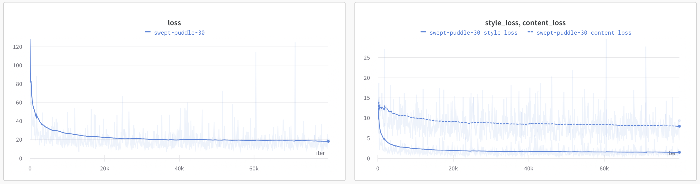

# Style Transfer
Implementation of Style Transfer by utilising the *Adaptive Instance Normalisation (AdaIN)* proposed by Huang et al. [1]. 

## AdaIN layer 


The AdaIN layer works by scaling the style ($y$) and content ($x$) image features acquired from the encoder. Specifically, AdaIN aligns the channel-wise mean and variance of the content features to the style features. The operation can be expressed as:

$$
AdaIN(x, y) = \sigma(y)(\frac{x-\mu(x)}{\sigma(x)})+\mu(y)
$$

The scaled feature maps from the AdaIN layer provide the input for the decoder which *generates* the final styled image ($t$).

Overall, the model's architecture consists of: an encoder (first 4 layers from VGG-19), AdaIN layer and a decoder.

## Loss function
The loss used for training of the decoder is a combination of content and style losses.

$$
L=L_C+\lambda L_s
$$

The content loss $L_C$ meassures the distance (difference) between the original content image and the generated image. It ensures that the content of the acquired image matches that of the original image. 
<!-- $L_C$ is defined as mean squared error (MSE) between the features of the generated image and the scaled features from the AdaIN operation (which represents the original content). -->

$$
L_{C} = \left\| f(t) - t \right\|^2
$$

On the other hand, the style loss $L_S$ ensures that the style of the generated image matches that of the input style image. 
<!-- It is computed as a sum of the distances of the mean values and the standard deviations of the outputs from the individual layers of the encoder.  -->

$$
L_{S} = \sum_{j=1} \left\| \mu(\phi_j(f(g))) - \mu(\phi_j(y)) \right\|^2 + \sum_{j=1} \left\| \sigma(\phi_j(f(g))) - \sigma(\phi_j(y)) \right\|^2
$$

The $\lambda$ parameter adjusts the extent of the transferred style that should be transferred from the style image to the content image.

<!-- 

Evolution of the loss during training. -->

## Dataset
The training dataset consisted; of style images acquired from the [WikiArt dataset](https://www.kaggle.com/competitions/painter-by-numbers/data) and content images from the [COCO dataset](https://cocodataset.org/#download).

## Results


<!--  -->

[## Live demo](https://kuko6-style-transfer.hf.space)

## Try it locally
set up a virtual environment with:
```sh
python3 -m venv venv
```

activate the virtual environment:
```sh
source venv/bin/activate
```

install the requirements:
```sh
pip install -r requirements.txt
```

run the gradio app localy:
```sh
python3 app.py
```

open `127.0.0.1:7860` in your browser.

## References

[1] Huang, Xun, and Serge Belongie. "Arbitrary style transfer in real-time with adaptive instance normalization." *Proceedings of the IEEE international conference on computer vision*. 2017.